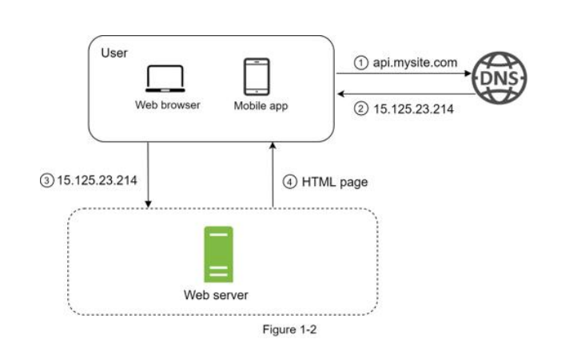

# Single Server Setup - Project 1-1


This project is a simple Java Spring Boot application demonstrating a single server setup, as described in the System Design Interview Textbook. It provides a basic structure for building and running a Spring Boot web application.

> **Note:** You will need to set up your own DNS to fully adapt the design.

**Production Request Flow (with DNS):**
1. User makes a request to a website URL.
2. The DNS provider resolves the URL and provides an IP address.
3. The IP address is then used to make a request to the server.
4. The server sends a response back to the user.



## Features
- Spring Boot application
- Single server architecture
- Simple static web page

## Project Structure
```
├── src/
│   ├── main/
│   │   ├── java/com/single_server1_1/demo/
│   │   │   ├── DemoApplication.java
│   │   │   └── SingleServer.java
│   │   └── resources/
│   │       ├── application.properties
│   │       └── static/index.html
│   └── test/
│       └── java/com/single_server1_1/demo/DemoApplicationTests.java
├── pom.xml
├── mvnw.cmd
├── README.md
```

## Getting Started

### Prerequisites
- Java 22
- Maven 3.5.2+

### Build and Run

1. **Clone the repository**
   ```powershell
   git clone <repository-url>
   cd "Project 1-1 Single Server Setup"
   ```

2. **Run the application**
   ```powershell
   ./mvnw.cmd spring-boot:run
   ```
   The application will start on [http://localhost:8080](http://localhost:8080).

3. **Access the web page**
   Open your browser and go to [http://localhost:8080](http://localhost:8080) to view the static index page.

## Customization
- Edit `src/main/resources/application.properties` to change server settings.
- Add more controllers or endpoints in `src/main/java/com/single_server1_1/demo/`.

## License
This project is for educational purposes.
