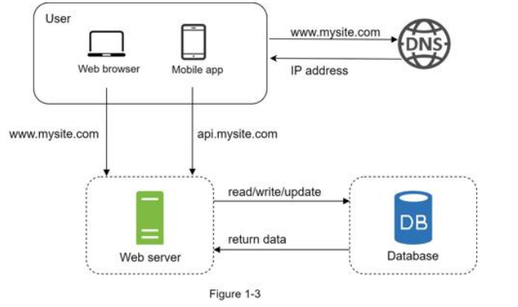

# Project 1-3: Server Setup with Database

## Overview

This project is a simple Spring Boot CRUD application for managing users, featuring a PostgreSQL database integration. It follows the figure 1-3 architecture as described in the System Design Interview Textbook and seen below.



Production Request Flow(with DNS): 
1. A user's browser sends an HTTP(GET, POST, etc) request to a website URL
2. The DNS provider resolves it and provides an IP address
3. The user's browser uses the IP address to send an HTTP request to the server
4. The server receives the request, processes it, and if necessary, sends a database query(SQL) to the database
5. The database executes the query, performs the required operation and sends back to the server
6. The server then takes the database's response, prepares an HTTP response, and sends it back to the user's client. 


## Features
- Create, Read, Update, Delete (CRUD) users
- RESTful endpoints
- Database persistence using JPA/Hibernate
- Layered structure for maintainability(Controller, Service, Repository, Model)

## Technologies Used
- Java 17+
- Spring Boot
- Spring Data JPA
- PostgreSQL (or compatible SQL database)
- Maven

## Project Structure
```
src/
  main/
    java/
      com/server/system/
        controller/      # REST controllers
        model/           # Entity classes
        repository/      # JPA repositories
        service/         # Service interfaces and implementations
    resources/
      application.properties # DB and app config
  test/
    java/
      com/server/system/    # Unit tests
```

## Setup Instructions
1. **Clone the repository**
2. **Configure the database**
   - Edit `src/main/resources/application.properties` with your DB credentials:
     ```properties
     spring.datasource.url=jdbc:postgresql://localhost:5432/yourdb
     spring.datasource.username=youruser
     spring.datasource.password=yourpassword
     spring.jpa.hibernate.ddl-auto=update
     ```
3. **Build and run the project**
   - In terminal:
     ```
     ./mvnw spring-boot:run
     ```
   - Or use VS Code Java plugins to run the main class: `SystemApplication.java`

## API Endpoints
| Method | Endpoint         | Description           |
|--------|------------------|-----------------------|
| POST   | /users           | Create a new user     |
| GET    | /users           | Get all users         |
| GET    | /users/{id}      | Get user by ID        |
| PUT    | /users/{id}      | Update user by ID     |
| DELETE | /users/{id}      | Delete user by ID     |

## Example User JSON
```json
{
  "name": "John Doe",
  "email": "john@example.com"
}
```

## Testing
- Run unit tests with:
  ```
  ./mvnw test
  ```

## Troubleshooting
- Ensure your database is running and accessible
- Check Java and Maven are installed
- For plugin issues in VS Code, install the Java Extension Pack

## License
This project is for educational purposes